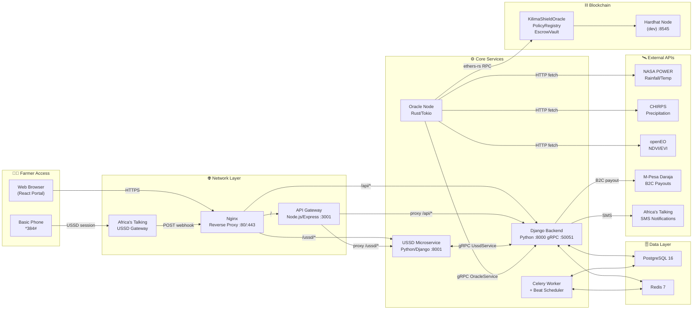
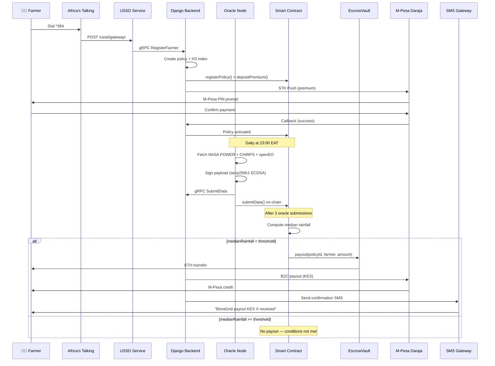
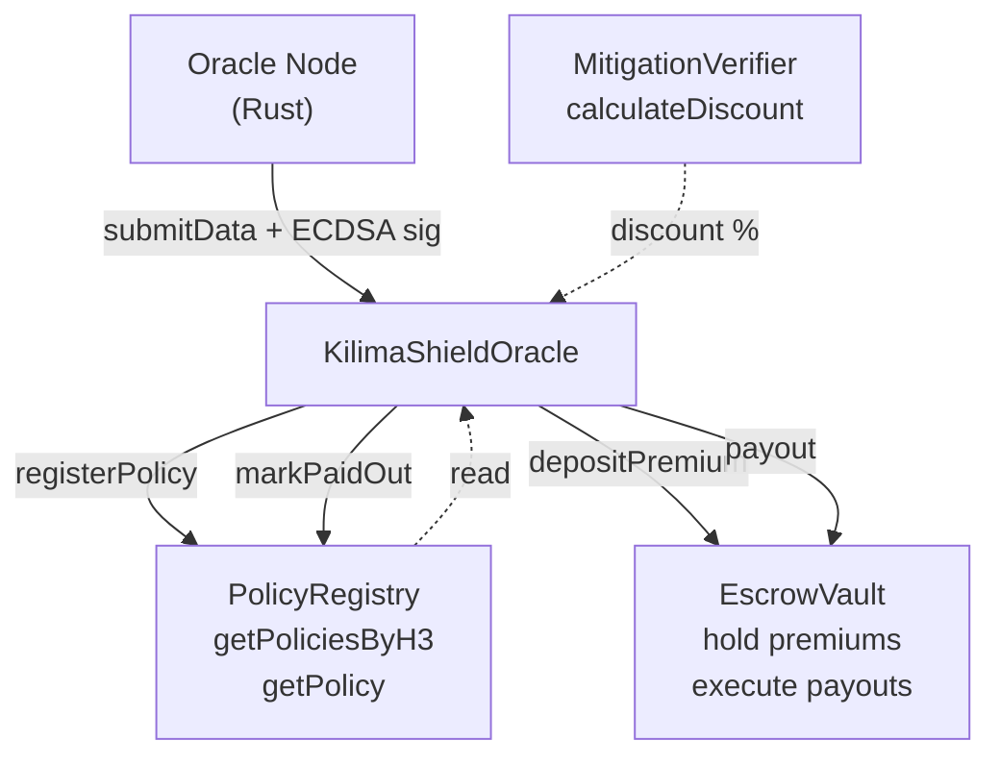

# BimaGrid — System Architecture

> Decentralized Parametric Climate Insurance Protocol for East African Smallholder Farmers

---

## Executive Summary

BimaGrid is a fully decentralized, multi-peril parametric insurance protocol engineered for smallholder and subsistence farmers across East Africa. By combining Uber H3 high-resolution spatial indexing, cloud-native satellite computing via openEO, independent Rust Oracle Nodes, and trustless Solidity smart contract execution on EVM-compatible blockchains, BimaGrid completely removes human bias, manual claims adjustment, and multi-month processing delays from agricultural climate insurance. Farmers register via USSD (*384#) in under 2 minutes using any basic mobile phone, and receive parametric payouts directly to their M-Pesa wallets within 60 seconds of on-chain consensus — zero paperwork, zero claims adjusters.

The protocol is composed of six discrete, independently deployable services communicating over a combination of REST/JSON, gRPC (HTTP/2 + Protocol Buffers), and direct blockchain RPC. A Rust Oracle Node daemon fetches daily satellite climate data (NASA POWER rainfall, openEO NDVI, CHIRPS precipitation), cryptographically signs each reading using secp256k1 ECDSA, and broadcasts it simultaneously to the Django Backend via gRPC and to the `KilimaShieldOracle` smart contract via ethers-rs. When three independent oracle nodes reach a median consensus that rainfall has fallen below a farmer's registered threshold, the `EscrowVault` contract executes an automatic ETH payout which the Django Celery worker converts into a real-time M-Pesa Daraja B2C transfer.

---

## Architecture Overview



---

## Service Topology

| Service | Technology | Port(s) | Role | Health Check |
|---|---|---|---|---|
| `backend` | Python 3.12, Django 4.2, DRF | 8000 (REST), 50051 (gRPC) | Core API, policy management, claim evaluation, oracle ingestion | `GET /health/` |
| `ussd` | Python 3.12, Django 4.2 | 8001 | Africa's Talking USSD gateway proxy; CON/END session router | `GET /health/` |
| `oracle-node` | Rust 1.78, tokio, tonic | — (client only) | Satellite data ingestion, ECDSA signing, dual on-chain + gRPC submission | — |
| `api-gateway` | Node.js 20, TypeScript, Express | 3001 | Rate limiting, CORS, request routing proxy to backend + ussd | `GET /health` |
| `frontend` | React 18, Next.js 14, TypeScript | 3000 | Farmer portal, admin dashboard, wallet connection | `GET /` |
| `celery-worker` | Python 3.12, Celery 5 | — | Async M-Pesa payouts, SMS notifications, claim processing | — |
| `celery-beat` | Python 3.12, Celery Beat | — | Scheduled oracle evaluation, STK push polling, report generation | — |
| `postgres` | PostgreSQL 16-alpine | 5432 | Primary relational database | `pg_isready` |
| `redis` | Redis 7-alpine | 6379 | Celery broker (db 0), result backend (db 1), USSD sessions (db 2), cache (db 3) | `redis-cli ping` |
| `nginx` | Nginx 1.25-alpine | 80, 443, 50051 | TLS termination, static files, gRPC passthrough, load balancing | `curl /health/` |
| `hardhat` | Node.js 20, Hardhat | 8545 | Local EVM for development and contract testing | — |

---

## Parametric Claim Lifecycle

### Step-by-Step Flow

1. **Farmer Registration** — Farmer dials `*384#` on any mobile phone → Africa's Talking USSD gateway delivers POST webhook to Nginx → routed to USSD Microservice
2. **USSD Session** — USSD service prompts for ward code, crop type, acreage, M-Pesa number → sends `RegisterFarmer` gRPC call to Django Backend
3. **Policy Creation** — Backend creates farmer account, computes H3 hex cell (res 9) for their GPS ward, generates premium quote, issues `PolicyRegistry.registerPolicy()` transaction, escrows ETH premium
4. **STK Push** — Backend triggers M-Pesa Daraja STK push for premium collection; on callback → policy activated
5. **Daily Oracle Cycle** — Oracle Node scheduler (tokio interval, 23:00 EAT) fetches NASA POWER rainfall + openEO NDVI for every monitored H3 cell
6. **Cryptographic Signing** — Oracle computes `keccak256(h3Index, timestamp, rainfall_scaled, ndvi_scaled)`, applies EIP-191 prefix, signs with secp256k1 private key
7. **Dual Submission** — Oracle broadcasts signed data simultaneously to: (a) Django Backend via gRPC `OracleService.SubmitData`, (b) `KilimaShieldOracle.submitData()` on-chain via ethers-rs
8. **On-Chain Consensus** — After 3 independent oracle submissions for same H3+timestamp → contract computes median rainfall → if `medianRainfall < threshold` → `EscrowVault.payout()` triggered
9. **M-Pesa Payout** — Django Backend receives oracle data, Celery task fires M-Pesa Daraja B2C payment → farmer receives KES within 60 seconds
10. **SMS Confirmation** — Africa's Talking SMS sent to farmer confirming payout amount and reference



---

## gRPC Protocol Architecture

### Proto Definition (`protos/bimagrid.proto`)

```protobuf
syntax = "proto3";
package bimagrid;

service OracleService {
  rpc SubmitData (OracleDataRequest) returns (OracleDataResponse);
}

service UssdService {
  rpc RegisterFarmer (RegisterFarmerRequest) returns (RegisterFarmerResponse);
  rpc GetPolicyStatus (PolicyStatusRequest) returns (PolicyStatusResponse);
  rpc FileClaim (FileClaimRequest) returns (FileClaimResponse);
}
```

### gRPC Service Methods

| Service | Method | Caller | Target | Description |
|---|---|---|---|---|
| `OracleService` | `SubmitData` | Rust Oracle Node | Django Backend :50051 | Submit signed satellite observation for an H3 hex cell |
| `UssdService` | `RegisterFarmer` | USSD Microservice | Django Backend :50051 | Register new farmer with crop, ward, acreage, M-Pesa |
| `UssdService` | `GetPolicyStatus` | USSD Microservice | Django Backend :50051 | Query active policy and next payment date for a phone number |
| `UssdService` | `FileClaim` | USSD Microservice | Django Backend :50051 | Initiate a manual claim lookup (parametric auto-evaluates) |

### gRPC Stubs Generation

```bash
# Regenerate Python stubs (backend + ussd)
bash scripts/generate_grpc.sh

# Run Django gRPC server (port 50051)
python backend/manage.py run_grpc_server

# Test with grpcurl
grpcurl -plaintext localhost:50051 list
grpcurl -plaintext -d '{"oracle_id":"oracle-1","h3_index":"8928308280fffff","timestamp":"2026-07-02T23:00:00Z","rainfall_mm":14.5,"ndvi":0.62,"soil_moisture":0.31,"data_sources":["nasa-power"],"signature":"0xdeadbeef"}' localhost:50051 bimagrid.OracleService/SubmitData
```

---

## Smart Contract Architecture

### Contracts (`contracts/contracts/core/`)

| Contract | Role | Key Optimization |
|---|---|---|
| `KilimaShieldOracle` | Multi-sig oracle consensus engine; triggers payout when 3-of-N oracles agree | Packed `DataPayload` struct (1 storage slot), `calldata` sig, `unchecked` loop |
| `PolicyRegistry` | Stores all farmer policies indexed by H3 cell | `address+bool+bool` packed in same slot, `uint128` threshold/payout |
| `EscrowVault` | Holds premium funds; executes parametric payouts; pull-payment refunds | `nonReentrant` + pull-payment pattern; `uint128` premiums |
| `MitigationVerifier` | Tracks verified farm interventions (drip irrigation, mulching) for premium discounts | Pure discount calculation, capped at 50% |

### Gas Optimizations Applied

| Optimization | Saving |
|---|---|
| `DataPayload` struct: `uint128+uint112+bool` → 1 storage slot | ~50% fewer SSTORE per oracle submission |
| `bytes calldata signature` instead of `memory` | Eliminates 65-byte memory copy per call |
| `unchecked { ++i }` in policy evaluation loop | ~30 gas per policy per consensus round |
| Memory-cached storage reads for 3-oracle payloads | Replaces 6 cold SLOADs with 3 warm reads |
| Custom errors (EIP-838) replacing `require(string)` | ~200 gas saved per revert path |
| `Policy` struct: `address+bool+bool` packed in slot 2 | 2 fewer storage slots per policy |
| Pull-payment refund pattern | Eliminates push-transfer re-entrancy vector |



---

## Spatial Indexing

BimaGrid uses **Uber H3 resolution 9** hexagonal cells (~0.1 km² each) as the fundamental spatial unit for both policy registration and oracle data submission.

- **Policy indexing**: When a farmer registers, their ward GPS coordinates are converted to an H3 cell ID. All policies within the same H3 cell share the same oracle data window.
- **Oracle data mapping**: Oracle nodes submit one climate reading per H3 cell per timestamp. The smart contract maps `h3Index => timestamp => oracle => DataPayload`.
- **bytes32 packing**: H3 indices are 64-bit integers stored as big-endian 32-byte values padded to the left with zeros for Solidity `bytes32` compatibility.

```python
import h3
cell = h3.latlng_to_cell(-1.286389, 36.817223, 9)  # Nairobi CBD → "8928308280fffff"
h3_bytes32 = bytes.fromhex(cell.zfill(64))          # left-pad to 32 bytes
```

---

## Security Architecture

| Layer | Mechanism | Details |
|---|---|---|
| Oracle Authentication | secp256k1 ECDSA (EIP-191) | Oracles sign `keccak256(h3, ts, rainfall, ndvi)` with private key; contract recovers signer and checks whitelist |
| Oracle→Backend gRPC | `X-Oracle-Signature` header | Hex-encoded 65-byte ECDSA signature attached to every gRPC call; backend optionally verifies |
| USSD→Backend gRPC | `X-USSD-Internal-Key` header | Shared secret API key for internal service channel (set via `BACKEND_API_KEY` env var) |
| REST API | JWT Bearer tokens (DRF SimpleJWT) | 60-min access token, 7-day refresh; standard `Authorization: Bearer <token>` header |
| Smart Contracts | `Ownable` + `ReentrancyGuard` | All state-mutating oracle functions require on-chain whitelist; payout uses `nonReentrant` guard |
| Smart Contract Errors | Custom errors (EIP-838) | 4-byte selectors replace string reverts; reduces attack surface and gas cost |
| Rate Limiting | express-rate-limit (120 req/min) | Enforced at API Gateway level; USSD endpoint allows 300 req/min for telco callback volume |
| TLS | Nginx SSL termination | All external traffic over HTTPS; internal Docker network uses plain HTTP |
| Non-root containers | uid 1001–1005 per service | All Docker images create and switch to dedicated non-root users |

---

## Technology Stack Reference

| Layer | Technology | Version | Purpose |
|---|---|---|---|
| Smart Contracts | Solidity | 0.8.20 | Parametric insurance logic, EscrowVault, Oracle consensus |
| Contract Tooling | Hardhat + ethers.js | 2.19 + v6 | Compilation, testing, deployment, gas reporting |
| Contract Libraries | OpenZeppelin | 5.x | `Ownable`, `ReentrancyGuard` |
| Oracle Runtime | Rust + tokio | 1.78 + 1.28 | Async Oracle Node daemon |
| Oracle gRPC Client | tonic + prost | 0.9 + 0.11 | Type-safe gRPC client for OracleService |
| Oracle Crypto | ethers-rs + k256 | 2.0 | secp256k1 signing, EIP-191 message hashing |
| Backend Framework | Django + DRF | 4.2 + 3.14 | Core REST API, ORM, admin |
| Backend gRPC | grpcio + grpcio-tools | 1.62+ | OracleService + UssdService server |
| Task Queue | Celery + Redis | 5.x + 7 | Async M-Pesa payouts, scheduled evaluation |
| USSD Framework | Django | 4.2 | Standalone USSD session router |
| USSD HTTP Client | httpx | 0.27 | Async HTTP calls from USSD to Backend (fallback REST) |
| API Gateway | Express + TypeScript | 4.18 + 5.3 | Rate limiting, CORS, reverse proxy |
| Frontend | Next.js + React | 14 + 18 | Farmer portal, admin dashboard |
| Database | PostgreSQL | 16 | Primary relational store |
| Cache / Broker | Redis | 7 | Celery, sessions, cache |
| Proxy | Nginx | 1.25 | TLS, routing, gRPC passthrough |
| Spatial Index | Uber H3 | 4.3+ | Hexagonal grid for policies and oracle data |
| Satellite (NDVI) | openEO | Cloud | EVI/NDVI computation via ESA Earth Engine |
| Satellite (Rain) | NASA POWER | Public API | Daily rainfall, temperature by coordinates |
| Satellite (Precip) | CHIRPS | Public API | High-resolution precipitation data |
| Payments | M-Pesa Daraja | B2C v1 | KES payouts to farmer M-Pesa wallets |
| SMS / USSD | Africa's Talking | v1 | USSD sessions + SMS notifications |
| Identity | IPRS | v1 | Kenya National ID verification |
| Land Registry | ArdhiSasa | v1 | Kenya land parcel verification |
| DevOps | Docker + Compose | 27+ | Container orchestration |
| CI/CD | GitHub Actions | — | Automated test + build pipeline |
| Protocols | gRPC / HTTP/2 | — | Oracle→Backend, USSD→Backend |

---

## Infrastructure & Deployment

### Docker Services (Root `docker-compose.yml`)

```bash
docker compose up -d          # Start all 11 services
docker compose logs -f backend # Stream backend logs
docker compose exec backend python manage.py shell
```

### Nginx Routing Table

| External Path | Upstream | Notes |
|---|---|---|
| `GET/POST /api/*` | `backend:8000` | Django REST API |
| `POST /ussd/gateway/` | `ussd:8001` | Africa's Talking USSD webhook |
| `GET/POST /` | `api-gateway:3001` | React frontend + gateway |
| `*:50051` | `backend:50051` | gRPC passthrough (HTTP/2) |
| `GET /health/` | nginx itself | Returns 200 OK |

### Environment Tiers

| Tier | Config | Database | Blockchain |
|---|---|---|---|
| Development | `DEBUG=True`, mock integrations | SQLite or local Postgres | Hardhat local node |
| Staging | `DEBUG=False`, sandbox APIs | Postgres (Docker) | Testnet (Mumbai/Sepolia) |
| Production | `DEBUG=False`, live APIs | Managed Postgres + replicas | Polygon/Ethereum mainnet |
