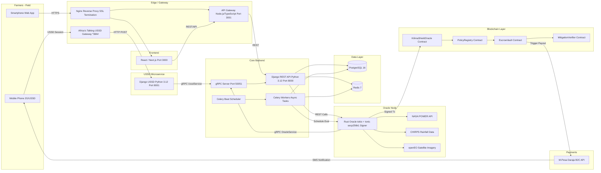
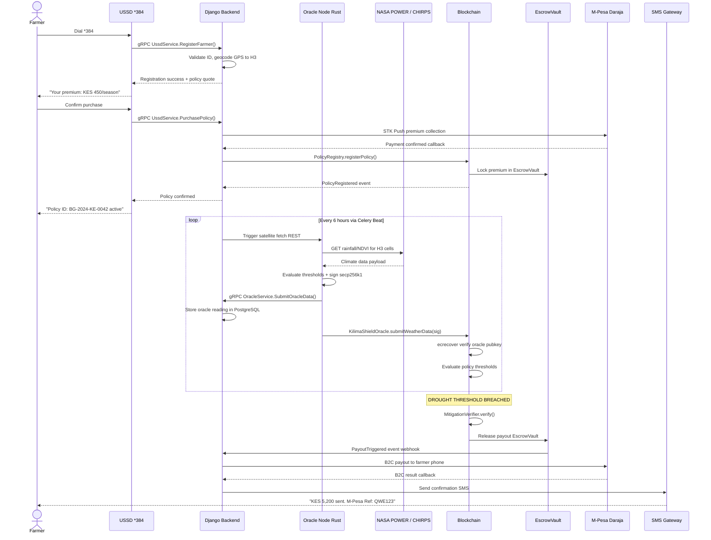
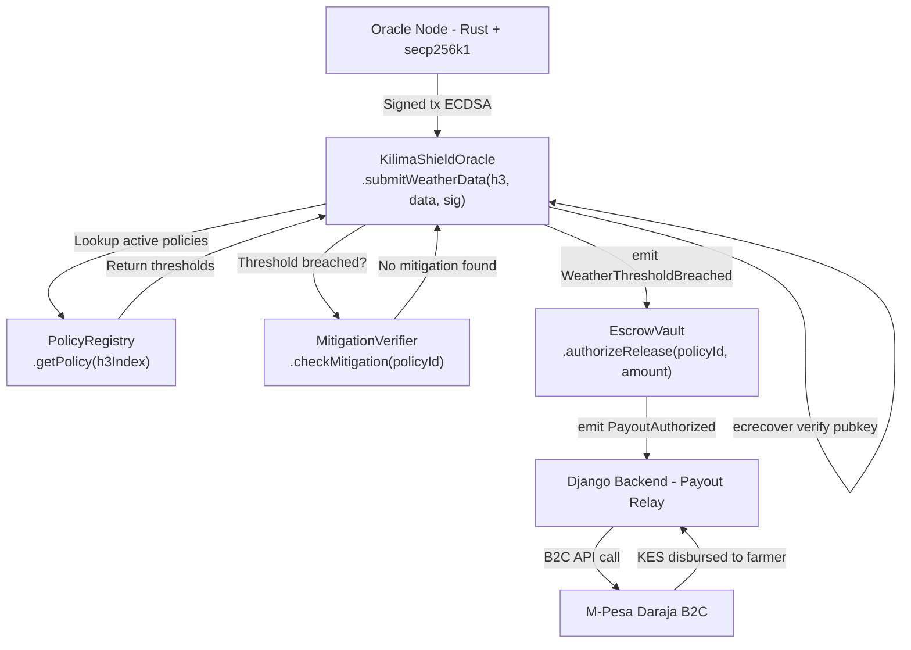

# BimaGrid System Architecture

> **Decentralized Parametric Climate Insurance for East African Smallholder Farmers**

---

## Table of Contents

1. [Executive Summary](#executive-summary)
2. [Architecture Overview](#architecture-overview)
3. [Service Topology](#service-topology)
4. [Parametric Claim Lifecycle](#parametric-claim-lifecycle)
5. [gRPC Protocol Architecture](#grpc-protocol-architecture)
6. [Smart Contract Architecture](#smart-contract-architecture)
7. [Spatial Indexing](#spatial-indexing)
8. [Security Architecture](#security-architecture)
9. [Technology Stack Reference](#technology-stack-reference)
10. [Infrastructure & Deployment](#infrastructure--deployment)

---

## Executive Summary

BimaGrid is a decentralized parametric climate insurance protocol designed to protect East African smallholder farmers against catastrophic weather events — including drought, flood, and crop failure — without requiring traditional claims assessment. Unlike conventional agricultural insurance, BimaGrid uses verifiable on-chain satellite data (NASA POWER, CHIRPS precipitation records, and openEO multispectral imagery) as objective triggers for automatic payouts. When a farmer's field, identified by its Uber H3 spatial index, experiences a measurable climate threshold breach — such as rainfall dropping below 40mm over a 30-day accumulation window — the protocol autonomously executes a payout via M-Pesa Daraja B2C within minutes, not weeks.

The platform bridges the gap between blockchain-native decentralized finance and low-connectivity rural communities through a USSD interface accessible on any mobile handset via Africa's Talking shortcode `*384#`. Farmers register, purchase policies, and receive status updates entirely through 2G USSD sessions, while the underlying infrastructure operates across a multi-service architecture: a Django REST + gRPC backend, Rust-based oracle nodes that cryptographically sign satellite observations, Solidity smart contracts governing policy escrow and claim settlement, and a React/Next.js dashboard for program administrators. Every oracle data submission is signed with secp256k1 ECDSA and verified on-chain before any payout is authorized, ensuring that no single party can manipulate weather outcomes or fraudulently trigger claims.

---

## Architecture Overview



---

## Service Topology

| Service | Technology | Port | Role | Health Check URL |
|---------|-----------|------|------|-----------------|
| **Django Backend** | Python 3.12 / Django 4.2 | `8000` | Core REST API, business logic, policy management, gRPC server host | `GET http://localhost:8000/health/` |
| **gRPC Server** | Django + grpcio | `50051` | Receives oracle submissions and USSD internal calls via Protobuf | `grpcurl localhost:50051 grpc.health.v1.Health/Check` |
| **USSD Microservice** | Python 3.12 / Django 4.2 | `8001` | Handles Africa's Talking USSD sessions for `*384#` | `GET http://localhost:8001/health/` |
| **Oracle Node** | Rust / tokio / tonic | Internal | Fetches satellite data, signs with secp256k1, submits via gRPC | Logs to stdout; Prometheus `/metrics` |
| **API Gateway** | Node.js / TypeScript / Express | `3001` | Rate limiting, auth middleware, route aggregation | `GET http://localhost:3001/health` |
| **Frontend** | React / Next.js 14 | `3000` | Admin dashboard, farmer portal, policy visualization | `GET http://localhost:3000/api/healthz` |
| **PostgreSQL 16** | PostgreSQL | `5432` | Primary relational database for all service data | `pg_isready -h localhost -p 5432` |
| **Redis 7** | Redis | `6379` | Celery broker, result backend, session cache, rate limiter | `redis-cli ping` |
| **Celery Workers** | Python / Celery 5 | — | Async task processing: oracle polling, claim evaluation | Monitor via Flower `http://localhost:5555` |
| **Celery Beat** | Python / Celery Beat | — | Scheduled tasks: 6-hour oracle polls, daily risk recalculation | Part of Celery process |
| **Nginx** | Nginx 1.25 | `80/443` | Reverse proxy, SSL termination, static file serving | `GET http://localhost/health` |
| **Smart Contracts** | Solidity 0.8.20 / Hardhat | On-chain | Policy registry, escrow, oracle verification, mitigation | Block explorer or `hardhat test` |

---

## Parametric Claim Lifecycle

### Step-by-Step Flow

1. **Farmer Registration**: Farmer dials `*384#`, USSD microservice captures national ID, phone number, farm GPS coordinates (converted to H3 cell index at resolution 9), and preferred crop type.
2. **Policy Issuance**: Backend generates a quote based on H3 zone's historical risk score, crop type, and coverage period. Farmer confirms premium payment via M-Pesa STK Push.
3. **On-Chain Registration**: `PolicyRegistry` smart contract records the policy with `policyId`, `h3Index` (bytes32 packed), coverage amount, and trigger thresholds.
4. **Escrow Funding**: Premium is split — protocol fee to treasury, remainder to `EscrowVault` contract keyed by `h3Index`.
5. **Continuous Monitoring**: Celery Beat triggers Oracle Node every 6 hours. Oracle fetches CHIRPS rainfall, NASA POWER evapotranspiration, and openEO NDVI for all active H3 cells.
6. **Threshold Evaluation**: Oracle Node evaluates accumulated rainfall against policy thresholds (e.g., `<40mm/30days` for drought trigger). If threshold is breached, oracle prepares a signed data payload.
7. **On-Chain Oracle Submission**: Oracle Node signs the weather data with secp256k1 private key and calls `KilimaShieldOracle.submitWeatherData()` on-chain. Contract verifies signature using `ecrecover`.
8. **Claim Trigger**: `KilimaShieldOracle` emits `WeatherThresholdBreached` event. `MitigationVerifier` validates that no mitigation activities (irrigation records) counteract the breach.
9. **Automated Payout**: `EscrowVault` releases funds proportional to breach severity. Smart contract calls M-Pesa Daraja B2C API via a trusted backend relay.
10. **SMS Notification**: Africa's Talking SMS gateway sends confirmation to farmer's registered phone number with payout amount and M-Pesa transaction ID.
11. **Audit Trail**: All events (policy creation, oracle submission, claim trigger, payout) are immutably recorded on-chain and mirrored to PostgreSQL for the admin dashboard.

### Sequence Diagram



---

## gRPC Protocol Architecture

### Proto File Summary (`bimagrid.proto`)

```protobuf
syntax = "proto3";
package bimagrid;

// OracleService: Oracle Node (Rust) -> Django Backend
service OracleService {
  rpc SubmitOracleData (OracleDataRequest) returns (OracleDataResponse);
  rpc GetActivePolicyCells (PolicyCellRequest) returns (PolicyCellResponse);
  rpc ReportOracleHealth (OracleHealthRequest) returns (OracleHealthResponse);
}

// UssdService: USSD Microservice (Django) -> Django Backend
service UssdService {
  rpc RegisterFarmer (RegisterFarmerRequest) returns (RegisterFarmerResponse);
  rpc PurchasePolicy (PurchasePolicyRequest) returns (PurchasePolicyResponse);
  rpc GetPolicyStatus (PolicyStatusRequest) returns (PolicyStatusResponse);
  rpc InitiateClaim (ClaimRequest) returns (ClaimResponse);
  rpc GetFarmerAccount (FarmerAccountRequest) returns (FarmerAccountResponse);
}

message OracleDataRequest {
  repeated string h3_cells = 1;
  double rainfall_mm = 2;
  double ndvi_score = 3;
  double evapotranspiration = 4;
  int64 timestamp = 5;
  bytes signature = 6;
  string oracle_pubkey = 7;
}

message RegisterFarmerRequest {
  string phone = 1;
  string national_id = 2;
  string name = 3;
  double gps_lat = 4;
  double gps_lng = 5;
  string crop_type = 6;
  double farm_area_ha = 7;
}

message PolicyStatusResponse {
  string policy_id = 1;
  string status = 2;
  double premium_paid = 3;
  double coverage_kes = 4;
  int32 days_remaining = 5;
  OracleDataRequest last_oracle_reading = 6;
}
```

### gRPC Services & Methods

| Service | Method | Direction | Description |
|---------|--------|-----------|-------------|
| `OracleService` | `SubmitOracleData` | Oracle → Backend | Submits signed climate observation for H3 cell batch |
| `OracleService` | `GetActivePolicyCells` | Oracle → Backend | Retrieves list of H3 cells with active policies to monitor |
| `OracleService` | `ReportOracleHealth` | Oracle → Backend | Heartbeat / liveness signal from oracle node |
| `UssdService` | `RegisterFarmer` | USSD → Backend | Creates farmer account with KYC data and H3 cell |
| `UssdService` | `PurchasePolicy` | USSD → Backend | Initiates policy purchase and M-Pesa STK Push |
| `UssdService` | `GetPolicyStatus` | USSD → Backend | Returns active policy details for a farmer |
| `UssdService` | `InitiateClaim` | USSD → Backend | Records manual claim initiation (supplements automated triggers) |
| `UssdService` | `GetFarmerAccount` | USSD → Backend | Returns farmer account details for USSD session |

### Key Message Types

| Message | Key Fields | Description |
|---------|-----------|-------------|
| `OracleDataRequest` | `h3_cells[]`, `rainfall_mm`, `ndvi_score`, `evapotranspiration`, `timestamp`, `signature`, `oracle_pubkey` | Signed batch of climate readings for one or more H3 cells |
| `OracleDataResponse` | `accepted`, `rejected_cells[]`, `reason` | Backend acknowledgment of submitted oracle data |
| `PolicyCellRequest` | `region_filter`, `active_only` | Filter params for fetching monitored H3 cells |
| `PolicyCellResponse` | `cells[]` (h3_index, policy_id, thresholds) | Active policy cells with trigger thresholds |
| `RegisterFarmerRequest` | `phone`, `national_id`, `name`, `gps_lat`, `gps_lng`, `crop_type`, `farm_area_ha` | Farmer registration payload from USSD |
| `PurchasePolicyRequest` | `farmer_id`, `h3_index`, `coverage_amount_kes`, `season_start`, `trigger_type` | Policy purchase intent |
| `PolicyStatusResponse` | `policy_id`, `status`, `premium_paid`, `coverage_kes`, `days_remaining`, `last_oracle_reading` | Full policy status for USSD display |
| `ClaimRequest` | `farmer_id`, `policy_id`, `incident_type`, `incident_date`, `notes` | Manual claim initiation |

---

## Smart Contract Architecture

### Contract Descriptions

#### `KilimaShieldOracle.sol`

The on-chain oracle registry and data verification contract. Accepts signed weather data payloads from authorized oracle nodes. Uses `ecrecover` to verify secp256k1 ECDSA signatures, ensuring only registered oracle public keys can submit data. Maintains a time-series mapping of `h3Index => WeatherReading[]` and emits `WeatherThresholdBreached` events when configured policy thresholds are exceeded.

#### `PolicyRegistry.sol`

Central policy ledger that records all active insurance policies as on-chain structs. Maps `policyId => Policy` where `Policy` contains farmer address, `h3Index` (bytes32), coverage amount (USDC/CELO), premium paid, trigger thresholds (rainfall floor, NDVI floor), and expiry. Inherits `AccessControl` for role-based admin operations and `Pausable` for emergency stops.

#### `EscrowVault.sol`

Holds premium funds in trust during the policy lifecycle. Implements a pull-over-push payment pattern — funds are authorized for release by `KilimaShieldOracle` events, then claimed by the backend relay for M-Pesa B2C disbursement. Supports multi-policy batching for gas efficiency. Emits `PayoutAuthorized(policyId, amount, farmerAddress)` events.

#### `MitigationVerifier.sol`

Optional verification layer that checks whether a farmer has registered mitigation activities (irrigation, supplemental watering) before authorizing a drought claim. Reads from a Merkle tree of submitted mitigation proofs, allowing farmers to dispute automated triggers. Can be toggled per-policy type.

### Gas Optimization Table

| Optimization | Contract | Technique | Estimated Saving |
|-------------|----------|-----------|-----------------|
| Batch oracle submissions | `KilimaShieldOracle` | Array input, single tx | ~60% vs individual calls |
| Packed H3 index | All contracts | `bytes32` instead of `string` | ~20,000 gas per policy |
| Mapping over arrays | `PolicyRegistry` | `mapping(bytes32 => Policy[])` | O(1) lookup |
| Events over storage | `EscrowVault` | Emit events, read off-chain | ~80% storage reduction |
| Assembly ecrecover | `KilimaShieldOracle` | Inline assembly | ~2,000 gas per verify |
| Short-circuit checks | `MitigationVerifier` | Early revert pattern | ~5,000 gas on invalid |
| Immutable oracle key | `KilimaShieldOracle` | `immutable` keyword | Deployment cost only |

### Contract Interaction Flowchart



---

## Spatial Indexing

### Uber H3 Resolution 9

BimaGrid uses [Uber H3](https://h3geo.org/) hexagonal hierarchical spatial indexing at **resolution 9** for all geospatial operations. At resolution 9, each H3 cell covers approximately **0.105 km²** (about 10.5 hectares), which aligns closely with the median East African smallholder farm size of 0.5–2 hectares, allowing 5–20 farms to share a single climate observation cell while maintaining precision adequate for regional weather differentiation.

| H3 Resolution | Average Area | Edge Length | Typical Use |
|--------------|-------------|-------------|-------------|
| 7 | 5.16 km² | 1.22 km | District-level aggregation |
| 8 | 0.74 km² | 0.46 km | Sub-location mapping |
| **9** | **0.105 km²** | **0.174 km** | **BimaGrid policy cells** |
| 10 | 0.015 km² | 0.066 km | Individual plot (too granular) |

### bytes32 Packing

H3 cell indexes at resolution 9 are 64-bit integers (8 bytes). BimaGrid packs them into Solidity `bytes32` with left-zero-padding for on-chain storage efficiency and event indexing:

```solidity
// H3 index: 0x8928308280fffff (resolution 9 cell)
// Stored as bytes32:
bytes32 h3CellKey = bytes32(uint256(h3Index));
// = 0x0000000000000000000000000000000000000000000000008928308280fffff

// Mapping for O(1) lookup
mapping(bytes32 => Policy[]) public policiesByCell;

// Indexed events for efficient log filtering
event PolicyCreated(bytes32 indexed h3Index, uint256 policyId, address farmer);
event WeatherThresholdBreached(bytes32 indexed h3Index, uint256 rainfallMm, uint256 timestamp);
```

### Oracle Data to Policy Mapping

```
GPS Coordinates (farmer registration)
        |
        v
H3 lat/lng to cell (resolution 9)
   e.g., (0.0236 S, 37.9062 E) -> 8928308280fffff
        |
        v
bytes32 packed index
   0x0000000000000000000000000000000000000000000000008928308280fffff
        |
        |---> PolicyRegistry.policiesByCell[]   All active policies in this cell
        |---> EscrowVault.escrowByCell          Pooled premium balance
        +---> KilimaShieldOracle.readings[]     Time-series weather data

Oracle Node (every 6h):
  Fetch CHIRPS/NASA POWER for H3 centroid
  -> Evaluate thresholds
  -> Sign with secp256k1
  -> submitWeatherData()
  -> KilimaShieldOracle maps h3Index to all policies
  -> Evaluates each threshold individually
```

---

## Security Architecture

| Layer | Mechanism | Details |
|-------|-----------|---------|
| **Transport** | TLS 1.3 | All external traffic via Nginx with Let's Encrypt certificates; gRPC channels use mTLS between Oracle Node and Backend |
| **API Authentication** | JWT Bearer Tokens | HS256-signed JWTs with 15-minute access tokens and 7-day refresh tokens; issued by Django SimpleJWT |
| **Oracle Authentication** | secp256k1 ECDSA | Oracle Node signs each weather data payload; `KilimaShieldOracle` verifies on-chain via `ecrecover`; oracle pubkey is whitelisted at contract deployment |
| **Smart Contract Access** | OpenZeppelin AccessControl | Role-based: `ORACLE_ROLE`, `ADMIN_ROLE`, `PAUSER_ROLE`; multi-sig (3-of-5) required for admin operations |
| **Contract Emergency Stop** | OpenZeppelin Pausable | `pause()` halts all payout operations; requires `PAUSER_ROLE`; circuit breaker for oracle manipulation |
| **USSD Session** | Session tokens + phone verification | Africa's Talking session IDs bound to phone numbers; one active session per phone; PIN required for financial operations |
| **Database** | Row-level encryption + TLS | Sensitive fields (national ID, bank details) encrypted at rest with AES-256; PostgreSQL connections require TLS |
| **Rate Limiting** | Redis token bucket | API Gateway enforces: 100 req/min per IP for public, 1000 req/min per authenticated user |
| **Input Validation** | Django serializers + Pydantic | All REST inputs validated by DRF serializers; gRPC inputs validated by Pydantic models before processing |
| **Oracle Node Key Management** | Environment secrets + HSM-ready | Oracle private key loaded from environment variable or HashiCorp Vault; never logged; key rotation procedure documented |
| **Dependency Security** | Automated scanning | Dependabot for Python/JS/Rust; `cargo audit`, `pip-audit`, `npm audit` in CI pipeline |
| **CORS** | Strict origin whitelist | Django CORS configured to allow only registered frontend domains; credentials mode enabled only for authenticated routes |

---

## Technology Stack Reference

| Layer | Technology | Version | Purpose |
|-------|-----------|---------|---------|
| **Core Backend** | Python | 3.12 | Runtime for Django and Celery services |
| **Core Backend** | Django | 4.2 LTS | Web framework, ORM, admin panel |
| **Core Backend** | Django REST Framework | 3.15 | REST API serializers, viewsets, routers |
| **Core Backend** | grpcio | 1.63 | gRPC server and client stubs |
| **Core Backend** | grpcio-tools | 1.63 | Protobuf compilation to Python |
| **Core Backend** | Django SimpleJWT | 5.3 | JWT authentication |
| **Core Backend** | Celery | 5.4 | Distributed task queue |
| **Core Backend** | django-celery-beat | 2.6 | Database-backed periodic tasks |
| **USSD Service** | Africa's Talking SDK | 1.2 | USSD session handling and SMS |
| **Oracle Node** | Rust | 1.78 stable | Systems language for oracle node |
| **Oracle Node** | tokio | 1.37 | Async runtime for Rust |
| **Oracle Node** | tonic | 0.11 | gRPC framework for Rust |
| **Oracle Node** | rust-secp256k1 | 0.29 | ECDSA signing of oracle data |
| **Oracle Node** | reqwest | 0.12 | Async HTTP client for satellite APIs |
| **Oracle Node** | serde / serde_json | 1.0 | Serialization / deserialization |
| **Smart Contracts** | Solidity | 0.8.20 | Smart contract language |
| **Smart Contracts** | Hardhat | 2.22 | Development environment and testing |
| **Smart Contracts** | OpenZeppelin Contracts | 5.0 | AccessControl, Pausable, ReentrancyGuard |
| **Smart Contracts** | ethers.js | 6.x | Contract interaction in tests/scripts |
| **Frontend** | React | 18.3 | UI component library |
| **Frontend** | Next.js | 14.2 | SSR framework with App Router |
| **Frontend** | TypeScript | 5.4 | Type safety |
| **Frontend** | Mapbox GL JS | 3.4 | H3 cell visualization on maps |
| **API Gateway** | Node.js | 20 LTS | Gateway runtime |
| **API Gateway** | TypeScript | 5.4 | Type safety |
| **API Gateway** | Express | 4.19 | HTTP framework |
| **API Gateway** | express-rate-limit | 7.x | Rate limiting middleware |
| **Database** | PostgreSQL | 16 | Primary relational database |
| **Database** | psycopg2 | 2.9 | Python PostgreSQL adapter |
| **Cache / Queue** | Redis | 7.2 | Celery broker, cache, rate limiter |
| **Infrastructure** | Docker | 26 | Containerization |
| **Infrastructure** | Docker Compose | 2.27 | Local multi-service orchestration |
| **Infrastructure** | Nginx | 1.25 | Reverse proxy, SSL, load balancing |
| **Payments** | M-Pesa Daraja API | v2 | STK Push (collection) + B2C (payouts) |
| **Satellite Data** | NASA POWER API | v2.5 | Solar radiation, temperature, humidity |
| **Satellite Data** | CHIRPS | v2.0 | Rainfall data (0.05 degree resolution) |
| **Satellite Data** | openEO | 1.2 | NDVI and multispectral band processing |
| **Spatial** | Uber H3 (h3-py) | 3.7 | Hexagonal spatial indexing |

---

## Infrastructure & Deployment

### Docker Compose Services

```yaml
# Key services in docker-compose.yml
services:
  postgres:
    image: postgres:16-alpine
    ports: ["5432:5432"]
    environment:
      POSTGRES_DB: bimagrid
      POSTGRES_USER: bimagrid_user

  redis:
    image: redis:7-alpine
    ports: ["6379:6379"]

  backend:
    build: ./backend
    ports: ["8000:8000", "50051:50051"]
    depends_on: [postgres, redis]

  ussd:
    build: ./ussd
    ports: ["8001:8001"]
    depends_on: [postgres, redis, backend]

  oracle:
    build: ./oracle-node
    # internal only, connects via gRPC to backend:50051
    depends_on: [backend]

  gateway:
    build: ./gateway
    ports: ["3001:3001"]
    depends_on: [backend]

  frontend:
    build: ./frontend
    ports: ["3000:3000"]

  celery:
    build: ./backend
    command: celery -A bimagrid worker --loglevel=info
    depends_on: [postgres, redis]

  celerybeat:
    build: ./backend
    command: celery -A bimagrid beat --loglevel=info
    depends_on: [postgres, redis]

  nginx:
    image: nginx:1.25-alpine
    ports: ["80:80", "443:443"]
    depends_on: [frontend, backend, gateway]

  flower:
    build: ./backend
    command: celery -A bimagrid flower
    ports: ["5555:5555"]
```

### Nginx Routing Table

| Path Pattern | Upstream | Notes |
|-------------|----------|-------|
| `/` | `frontend:3000` | Next.js SSR pages |
| `/api/v1/` | `gateway:3001` | All REST API calls via gateway |
| `/admin/` | `backend:8000` | Django admin panel (IP-restricted) |
| `/ussd/` | `ussd:8001` | Africa's Talking webhook endpoint |
| `/health` | `backend:8000` | Load balancer health probe |
| `/static/` | Static files | Nginx serves directly from volume |
| `/media/` | Static files | Uploaded documents |
| `/flower/` | `flower:5555` | Celery monitoring (VPN only) |

### Environment Tiers

| Tier | Description | Blockchain Network | Oracle Mode |
|------|-------------|-------------------|-------------|
| **Development** | Local Docker Compose | Hardhat local node (chainId: 31337) | Mock satellite data |
| **Staging** | GCP Cloud Run + Cloud SQL | Alfajores testnet (Celo) | Real satellite APIs |
| **Production** | GCP GKE + Cloud SQL HA | Celo Mainnet | Real satellite APIs + HSM key |

### Production Infrastructure (GCP)

```
GCP Project: bimagrid-prod
├── GKE Cluster (3 nodes, e2-standard-4)
│   ├── Namespace: bimagrid-backend
│   ├── Namespace: bimagrid-oracle
│   └── Namespace: bimagrid-frontend
├── Cloud SQL: PostgreSQL 16 (HA, 2 replicas)
├── Memorystore: Redis 7 (1GB)
├── Cloud Load Balancer -> GKE Ingress (Nginx)
├── Cloud Armor: DDoS protection + WAF rules
├── Secret Manager: DB passwords, JWT secrets, oracle private keys
└── Cloud Monitoring + Alerting
```
