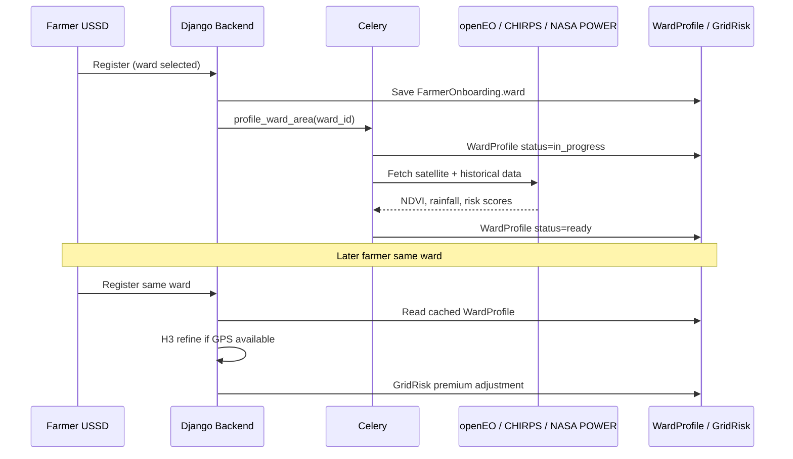

# BimaGrid Onboarding — Design & Brainstorm Document

For a design session with the product team. Assumptions are flagged where the codebase and docs disagree.

---

## Table of Contents

1. [Doc Context (Brief Synthesis)](#doc-context-brief-synthesis)
2. [A. Current State — Code vs Docs](#a-current-state--code-vs-docs)
3. [B. User Journeys to Design](#b-user-journeys-to-design)
4. [C. Proposed End-to-End Onboarding Procedure (Steps 0–11)](#c-proposed-end-to-end-onboarding-procedure-steps-011)
5. [D. Open Questions / Decisions (12)](#d-open-questions--decisions-12)
6. [E. Mermaid Flowchart — Proposed Onboarding](#e-mermaid-flowchart--proposed-onboarding)
7. [F. MVP vs Phase 2](#f-mvp-hackathon-demo-vs-phase-2-production)
8. [Geography Data Model & USSD Hierarchy](#geography-data-model--ussd-hierarchy)
9. [Area Profiling & Data Prefetch Strategy](#area-profiling--data-prefetch-strategy)
10. [Assumptions & Strong Opinions](#assumptions--strong-opinions)

---

## Doc Context (Brief Synthesis)

### Three-plane architecture and onboarding

Onboarding lives primarily in **Plane 1 (Operational Data Plane)** — Django, PostGIS/H3, IPRS, ArdhiSasa, openEO, pricing. It produces a **policy manifest** (farmer + H3 cell + crop + premium + triggers) that Plane 2 (oracles) monitors and Plane 3 (contracts + M-Pesa) executes.

The **Farmer/Agent interface** (USSD, agent portal, SMS) is the entry layer; it should not duplicate business logic — it collects data and calls Plane 1.

`ARCHITECTURE.md` emphasizes USSD → gRPC → backend → STK → on-chain registration. `README.md` adds IPRS, ArdhiSasa OCR, 3-oracle consensus, and ward-based USSD — richer than what is wired in code today.

### USSD vs agent portal vs API paths

| Path | Docs | Code reality |
|------|------|--------------|
| **USSD** (`*384#`) | Ward drill-down → crop → acreage → M-Pesa confirm → registration complete | **Updated:** County → Sub-County → Constituency → Ward hierarchical menus when geography data is loaded; legacy 4-digit fallback otherwise |
| **Agent portal** | Full KYC, map/GPS, documents, quote, approve | Partial: `RegisterFarmerModal` creates auth user only; onboarding fields in form are **not persisted** |
| **REST API** | `POST /onboarding/register-farmer/`, OTP verify, GPS, national ID | **Not implemented** — only `GET/PATCH /onboarding/` and `POST /onboarding/submit/` |

### 5-tier verification model

**README / product vision:** Identity (IPRS) → land (ArdhiSasa) → satellite → documents → verified onboarding.

**Code (`constants.py` + `services.py`):**

| Tier | Label | Trigger in code |
|------|-------|-----------------|
| 1 | Profile linked | Default on `FarmerOnboarding` create |
| 2 | Farm details captured | `ward_code` + `crop` + `acreage` + `mpesa_number` |
| 3 | Parcel evidence attached | At least one `LandParcel` |
| 4 | Supporting documents reviewed | Parcel has `ownership_docs` |
| 5 | Onboarding verified | Status ∈ `{submitted, under_review, verified}` |

IPRS/ArdhiSasa clients exist but are **not** tied to tier progression. USSD self-registration jumps to tier 5 immediately via `submit_onboarding()`.

### External integrations in onboarding

| Integration | Role in docs | Code |
|-------------|--------------|------|
| **IPRS** | National ID verification | `IPRSClient` with mock; `verify_farmer_identity()` — no view/USSD hook |
| **ArdhiSasa** | Title/parcel ownership | `ArdhiSasaClient` with mock; `verify_land_parcel()` — unused in flows |
| **openEO** | Mitigation (NDWI irrigation), NDVI | `verify_irigation()` in verification app; mock by default |
| **H3** | GPS → res-9 cell for pricing/oracle | Models + `pricing/engine.py`; USSD flow **does not capture GPS/H3** |
| **M-Pesa STK** | Premium payment at policy issuance | `initiate_stk_payment()` exists; **not called from onboarding/USSD** |

### Kenya ward/geography data

Source files at repo root:

- `Kenya_counties_subcounties_constituencies_wards.json` — phpMyAdmin export with `counties`, `subcounties`, and `station` (constituency + ward) tables
- `Kenya_counties_subcounties_constituencies_wards.sql` — equivalent SQL dump

JSON structure:

- **`counties`**: `county_id`, `county_name` (47 counties)
- **`subcounties`**: `subcounty_id`, `county_id`, `constituency_name` (sub-county label in source data)
- **`station`**: `station_id`, `subcounty_id`, `constituency_name`, `ward` (~1,450 wards)

Load into Django via:

```bash
cd backend
python manage.py migrate
python manage.py load_kenya_admin_boundaries
# Optional: reload from a custom path
python manage.py load_kenya_admin_boundaries --json-path ../Kenya_counties_subcounties_constituencies_wards.json --clear
```

---

## A. Current State — Code vs Docs

### What exists today

**Backend (`apps/onboarding/`)**

- `FarmerOnboarding` + `LandParcel` with verification levels, agent assignment (`assigned_agent` → broker role), status workflow
- Optional `ward` FK to `geospatial.Ward` plus legacy `ward_code` string for backward compatibility
- Authenticated CRUD: `GET/PATCH /api/v1/onboarding/`, `POST /api/v1/onboarding/submit/`
- USSD internal: `POST /api/v1/ussd/internal/register/` — creates profile, saves farm fields, auto-submits
- Pricing engine (`calculate_premium`) with H3 grid risk + mitigation discounts
- Payments: STK push + callback pipeline (policy-scoped, not onboarding-scoped)
- IPRS, ArdhiSasa, openEO integration stubs with mocks

**Geography (`apps/geospatial/`)**

- Models: `County`, `SubCounty`, `Constituency`, `Ward`, `WardProfile`
- Management command: `load_kenya_admin_boundaries`
- Public API drill-down endpoints (see [Geography Data Model & USSD Hierarchy](#geography-data-model--ussd-hierarchy))

**USSD (`backend/apps/ussd/` + `ussd/src/flows/registration/`)**

- Menu option 1: **County → Sub-County → Constituency → Ward** (when geography loaded) → crop → acreage → M-Pesa confirm → backend register
- Triggers `profile_ward_area` Celery task on first registration in a ward
- End screen: *"Premium quote pending agent review."*
- No national ID, GPS, season, mitigation, quote, or payment steps

**Frontend**

- Agent dashboard with `RegisterFarmerModal` — auth registration only
- `getOnboarding` / `updateOnboarding` / `submitOnboarding` API helpers exist but no dedicated onboarding wizard UI

**Docs (`API.md`)**

- Describes a richer flow: GPS, national ID, OTP, H3 on register, STK on policy create — largely aspirational vs routes in `urls.py`

### Major gaps (docs ↔ code)

1. ~~**Ward codes**: 4-digit free text vs `station_id` in Kenya JSON~~ — **Addressed:** hierarchical USSD + ward FK; legacy 4-digit fallback retained when geography not loaded
2. **No H3 at USSD registration**: Docs/architecture assume GPS→H3; USSD never collects coordinates
3. **No identity step on USSD**: Docs show national ID + OTP; USSD is phone-only
4. **`register-farmer` / `verify-identity` endpoints**: Documented in `API.md`, missing from backend
5. **Agent portal data loss**: Form collects ward/crop/acreage/H3 but `registerFarmer()` only calls auth register
6. **Policy issuance disconnected**: USSD registration does not create policy, quote, or STK
7. **Tier 5 on submit**: USSD bypasses tiers 3–4 (parcels, documents)
8. **Dual USSD implementations**: Legacy `backend/apps/ussd/services.py` + standalone `ussd/` microservice
9. **`docs/api/ussd-api.md`**: Empty stub (title only)
10. **gRPC proto mismatch**: `ARCHITECTURE.md` RegisterFarmer has GPS/national_id; proto has ward_code/crop/acreage/mpesa

---

## B. User Journeys to Design

### 1. Farmer USSD self-registration (`*384*XXX#`)

**Target user:** Smallholder with basic phone, limited literacy, intermittent connectivity.

**Design intent:** Minimum friction — phone is identity anchor; hierarchical ward selection locates admin geography; defer heavy KYC until higher coverage or claim.

**Opinion:** Keep USSD to ~8–10 screens max. Push national ID and parcel docs to SMS link or agent follow-up unless IRA requires ID at bind.

**Offline note:** USSD is session-based (Africa's Talking); true offline queue needs field-agent path (#3).

### 2. Agent-assisted registration (web portal)

**Target user:** Broker/agent with smartphone/laptop in county office.

**Design intent:** Full data capture — IPRS, map pin or ArdhiSasa title, land polygon, mitigation checklist, instant quote, optional STK on farmer's phone, assign `assigned_agent`, approve → issue policy.

**Opinion:** This should be the **source of truth** for tier 3–5 progression. USSD self-reg creates a **draft**; agent elevates to verified.

### 3. Field agent offline-first (USSD + sync later)

**Target user:** Extension worker in low-connectivity areas.

**Design intent:** Agent dials USSD on farmer's phone (or shared handset) using a **agent prefix menu** (*384*XXX*agent#*) OR agent app with offline SQLite queue syncing to `POST /api/v1/onboarding/` when online.

**Opinion:** For hackathon, simulate with agent portal + "Save draft offline" flag. Production needs explicit `registered_by_agent_id` + `sync_status` on onboarding.

---

## C. Proposed End-to-End Onboarding Procedure (Steps 0–11)

Below: **recommended target state** blending docs + code strengths. Each step includes actor, channel, data, validation, API, integration, failures, UX copy.

---

### Step 0 — Session start

| | |
|---|---|
| **Actor** | Farmer or agent |
| **Channel** | USSD / Web |
| **Data** | MSISDN from telco |
| **Validation** | Normalize to `254XXXXXXXXX` |
| **API** | Session only (USSD); JWT login (web) |
| **Integration** | Africa's Talking session ID |
| **Failure** | Invalid session → `END Session expired. Dial again.` |
| **Copy** | `CON Welcome to BimaGrid.\n1. Register\n2. Policy Status\n3. Claims` |

---

### Step 1 — Identity capture (phone)

| | |
|---|---|
| **Actor** | Farmer |
| **Channel** | USSD (implicit) / Agent web |
| **Data** | Phone (auto), optional national ID |
| **Validation** | Kenyan MSISDN format |
| **API** | `get_or_create_farmer_profile(phone)` (existing) |
| **Integration** | None |
| **Failure** | Duplicate active policy same season+H3 → block later at quote |
| **Copy (USSD)** | Phone used automatically |
| **Copy (web)** | "Farmer phone number (M-Pesa number)" |

**Decision flag:** National ID optional at USSD tier-1 vs required before payment.

---

### Step 2 — National ID + IPRS (Tier 1→2 upgrade)

| | |
|---|---|
| **Actor** | Farmer (USSD digits) or Agent (form) |
| **Channel** | USSD: 8-digit ID; Web: ID + names + DOB |
| **Data** | `national_id`, `first_name`, `last_name`, `date_of_birth` |
| **Validation** | Format; IPRS match confidence ≥ threshold |
| **API** | **New:** `POST /api/v1/onboarding/verify-identity/` → `verify_farmer_identity()` |
| **Integration** | IPRS (mock in dev) |
| **Failure** | Partial match → agent review queue; hard fail → retry 2x then SMS support |
| **Copy** | `CON Enter National ID number:` → `CON Confirm name: 1. Yes 2. Re-enter` |

*Skip in MVP USSD; require on agent path only.*

---

### Step 3 — Ward / location (hierarchical drill-down)

| | |
|---|---|
| **Actor** | Farmer |
| **Channel** | USSD |
| **Data** | `ward` FK via County → Sub-County → Constituency → Ward menus |
| **Validation** | Lookup in Kenya admin tables; reject unknown selections |
| **API** | `GET /api/v1/geography/counties/` → nested subcounties/constituencies/wards |
| **Integration** | `load_kenya_admin_boundaries` management command |
| **Failure** | Geography not loaded → legacy 4-digit `station_id` prompt |
| **Copy** | See [USSD screen sequence](#ussd-screen-sequence-county--sub-county--constituency--ward) |

**Design decision (implemented):** Replace arbitrary 4-digit codes with **numbered hierarchical menus**. Store canonical `Ward.external_id` (`station_id`) in `ward_code` (zero-padded) for backward compatibility.

---

### Step 4 — Crop, acreage, season

| | |
|---|---|
| **Actor** | Farmer / Agent |
| **Channel** | USSD / Web |
| **Data** | `crop`, `acreage`, `season_start`, `season_end` (default current long rains) |
| **Validation** | `CropChoice` enum; acreage > 0; season dates valid |
| **API** | PATCH `/onboarding/` or USSD internal register (extend payload) |
| **Integration** | Crop risk matrices in pricing |
| **Failure** | Acreage > ward median × 10 → flag for review |
| **Copy** | `CON Select crop:\n1.Maize 2.Beans...` → `CON Enter acres (e.g. 2.5):` |

---

### Step 5 — Land parcel / H3 indexing

| | |
|---|---|
| **Actor** | Farmer (SMS GPS link) or Agent (map) |
| **Channel** | Web map / SMS deep link / future USSD "send GPS" |
| **Data** | `gps_lat`, `gps_lng` OR GeoJSON polygon → `h3_index` res-9, `LandParcel` |
| **Validation** | Point in Kenya bounds; H3 cell has `GridRisk` coverage |
| **API** | `GET /api/v1/geospatial/h3-index/`; PATCH onboarding `land_parcels[]` |
| **Integration** | h3-py; optional ArdhiSasa title match |
| **Failure** | No coverage → `422 coverage_area_unavailable` |
| **Copy** | SMS: "Reply with location pin" or agent: "Drop pin on farm center" |

**Critical gap fix:** USSD alone cannot set H3 — need agent follow-up or SMS location request for self-serve.

---

### Step 6 — Mitigation measures + openEO path

| | |
|---|---|
| **Actor** | Farmer (yes/no) or Agent (checkbox + photo) |
| **Channel** | USSD menu / Web |
| **Data** | `mitigations[]`: drip_irrigation, water_harvesting, etc. |
| **Validation** | If claimed → async openEO NDWI check |
| **API** | PATCH onboarding; **New:** `POST /api/v1/verification/mitigation/` |
| **Integration** | openEO `verify_irrigation(h3_index)` — 30-day NDWI vs threshold |
| **Failure** | Claim rejected → premium recalc without discount; notify SMS |
| **Copy** | `CON Do you use drip irrigation?\n1.Yes 2.No` → "Verification via satellite in 24h" |

Tier 4 in product terms: mitigation **verified** by satellite, not just self-reported.

---

### Step 7 — Premium quote

| | |
|---|---|
| **Actor** | System → Farmer |
| **Channel** | USSD END summary / SMS |
| **Data** | `h3_index`, crop, acreage, mitigations → `final_premium`, coverage band |
| **Validation** | Min/max premium rules; quote TTL (e.g. 48h) |
| **API** | `POST /api/v1/pricing/quotes/` (PremiumQuoteViewSet) or internal quote for USSD |
| **Integration** | `calculate_premium()` + `GridRisk` + ward baseline from `WardProfile` |
| **Failure** | Missing H3 → "Agent will call you with quote" |
| **Copy** | `END Your premium: KES 450 for 2.5 acres maize.\nReply 1 on next dial to pay.` |

---

### Step 8 — M-Pesa STK premium payment

| | |
|---|---|
| **Actor** | Farmer |
| **Channel** | USSD confirm → STK on handset |
| **Data** | `mpesa_number`, `policy_id`, amount |
| **Validation** | Phone matches; payment not duplicate |
| **API** | Create `Policy` (draft) → `initiate_stk_payment()` → callback activates |
| **Integration** | M-Pesa Daraja STK |
| **Failure** | Timeout/cancel → `END Payment cancelled. Dial *384# and choose Pay Premium.` |
| **Copy** | `CON Pay KES 450 now?\n1. Yes 2. Later` → STK push |

---

### Step 9 — Policy issuance (+ optional on-chain mint)

| | |
|---|---|
| **Actor** | System (on STK success) |
| **Channel** | Backend + blockchain relay |
| **Data** | Policy number, H3 bytes32, thresholds, season window |
| **Validation** | Agent approval gate (if enabled); duplicate policy check |
| **API** | Policy create; `integrations/blockchain.py` mint |
| **Integration** | PolicyRegistry contract |
| **Failure** | Chain unavailable → policy `active_offchain`; retry mint async |
| **Copy** | SMS: "Policy BG-2026-KE-0042 ACTIVE. Cover KES 12,500 until Sep 30." |

---

### Step 10 — Verification tier progression

| | |
|---|---|
| **Actor** | System + Agent |
| **Channel** | Background jobs + admin |
| **Data** | Tiers 1–5 as defined; map IPRS→tier2, parcels→3, docs/openEO→4, agent approve→5 |
| **Validation** | Do not set tier 5 on USSD submit alone |
| **API** | `refresh_onboarding_level()`; agent `PATCH status=verified` |
| **Integration** | Celery tasks |
| **Failure** | Stuck in `under_review` > 72h → SMS + escalate |
| **Copy** | SMS: "Verification level 3/5 — add land document at agent office." |

---

### Step 11 — SMS confirmation

| | |
|---|---|
| **Actor** | System |
| **Channel** | Africa's Talking SMS |
| **Data** | Policy #, premium receipt, M-Pesa ref, short USSD reminder |
| **API** | `send_notification_async` (exists on payout; extend to onboarding) |
| **Copy** | "BimaGrid: Registration complete. Policy BG-0042. Premium KES 450 paid. Ref: QWE123." |

---

## D. Open Questions / Decisions (12)

1. **Ward selection UX:** ~~Use `station_id` (padded 4-digit) from Kenya JSON, or hierarchical USSD menu?~~ **Decided:** Hierarchical County → Sub-County → Constituency → Ward menus; `station_id` stored as `ward_code`.

2. **When is national ID required?** Before quote, before payment, or only above KES X coverage? *Regulatory vs friction tradeoff.*

3. **Agent approval gate:** Can USSD self-reg bind an active policy, or only create `submitted` until broker approves? *Code today auto-submits to tier 5 — likely wrong for production.*

4. **Payment before vs after tier 3:** Pay on phone with ward-only location (higher basis risk) vs require H3/parcel first? *Demo favors pay-first; production favors parcel-first.*

5. **H3 capture method for USSD farmers:** SMS location link, agent visit, or ward centroid fallback (explicit basis-risk disclosure)?

6. **Mitigation verification timing:** Apply discount at quote (optimistic) or after openEO confirms (conservative)?

7. **Duplicate registration:** One onboarding per phone per season, or allow multiple parcels/policies?

8. **Offline field sync:** Build agent mobile app queue vs extended USSD with deferred backend POST?

9. **Identity without IPRS production access:** Mock-only for hackathon — show IPRS in agent UI with mock badge?

10. **On-chain mint:** Mandatory for `active` status or optional `metadata.on_chain_tx`?

11. **Crop menu on USSD:** Expand to match `CropChoice` (9 crops) or keep 4 + "Other → agent"?

12. **Language:** English-only USSD vs Kiswahili prompts — impacts screen length limits (182 chars).

---

## E. Mermaid Flowchart — Proposed Onboarding

```mermaid
flowchart TD
    Start([Dial *384# or Agent Portal]) --> Auth{Channel?}
    Auth -->|USSD| PhoneAuto[Phone from MSISDN]
    Auth -->|Web| AgentLogin[Agent JWT Login]

    PhoneAuto --> Menu[Main Menu: Register]
    AgentLogin --> AgentForm[Capture farmer + optional ID]

    Menu --> County[Select County]
    County --> SubCounty[Select Sub-County]
    SubCounty --> Constituency[Select Constituency]
    Constituency --> Ward[Select Ward]
    Ward --> WardVal{Valid ward?}
    WardVal -->|No| Ward
    WardVal -->|Yes| ProfileWard[Trigger ward area profile if first farmer]
    ProfileWard --> Crop[Crop + Acreage + Season]

    AgentForm --> IPRS{IPRS verify?}
    IPRS -->|Pass| Crop
    IPRS -->|Fail| ManualReview[Queue manual review]

    Crop --> MpesaConfirm[Confirm M-Pesa number]
    MpesaConfirm --> Loc{H3 / GPS available?}

    Loc -->|USSD only| Draft[Save onboarding DRAFT tier 2]
    Loc -->|Agent/SMS GPS| H3[Compute H3 res-9 + LandParcel tier 3]

    Draft --> AgentFollow[Agent assigns + adds parcel]
    AgentFollow --> H3

    H3 --> Mitig{Mitigation claimed?}
    Mitig -->|Yes| OpenEO[openEO NDWI verify async]
    Mitig -->|No| Quote
    OpenEO --> Quote[Pricing engine quote using ward baseline + H3 GridRisk]

    Quote --> ShowQuote[Show premium USSD END / SMS]
    ShowQuote --> PayChoice{Farmer pays now?}

    PayChoice -->|No| Pending[SMS reminder tier 4 pending]
    PayChoice -->|Yes| STK[M-Pesa STK Push]

    STK --> STKResult{Payment OK?}
    STKResult -->|No| PayRetry[Retry / agent assist]
    STKResult -->|Yes| Policy[Create Policy ACTIVE]

    Policy --> Chain{Mint on-chain?}
    Chain -->|Yes| Mint[PolicyRegistry.register]
    Chain -->|Skip MVP| OffChain[active_offchain flag]

    Mint --> SMS
    OffChain --> SMS[SMS confirmation]
    SMS --> Tier5[Agent final verify tier 5]
    Tier5 --> Done([Onboarding complete])
```



---

## F. MVP (Hackathon Demo) vs Phase 2 (Production)

### MVP — ship for demo (~5 min script)

| Include | Defer |
|---------|-------|
| USSD County → Ward → crop → acreage → M-Pesa (implemented) | Real IPRS / ArdhiSasa |
| `load_kenya_admin_boundaries` + geography API | Full openEO ward polygon fetch |
| Agent portal: register farmer **and** PATCH onboarding with H3 from map | Full offline sync |
| Auto-quote via `calculate_premium()` using **ward centroid → default H3** (document as demo shortcut) | GPS capture on USSD |
| STK payment → create Policy → show in dashboard | Mandatory on-chain mint |
| Mock openEO mitigation discount in quote if checkbox ticked | Async NDWI verification |
| SMS on registration + payment (Africa's Talking sandbox) | Multi-language |
| God Mode: `simulate-drought` + payout (README demo script) | 3-oracle consensus UI |
| Ward profiling Celery stub (`profile_ward_area`) | Production CHIRPS/NASA POWER ingestion |
| Show verification tier badges in admin (fix: USSD submit → tier 2 not 5) | Full tier 5 agent workflow |

**Demo narrative:** USSD farmer selects ward → ward profile prefetched → agent adds H3 on map → quote SMS → STK → policy active → trigger drought → M-Pesa payout.

### Phase 2 — production

- IPRS + ArdhiSasa in agent workflow; tier gating enforced
- Real GPS / polygon capture; ArdhiSasa title OCR
- openEO mitigation verification pipeline (Celery + discount adjustment)
- USSD payment + policy status menu wired end-to-end
- On-chain policy mint + escrow funding
- Agent RBAC on assigned onboardings (partially in `core/queryset.py`)
- Ward-based analytics; IRA audit export
- Offline agent app with sync
- Kiswahili USSD; SMS location capture for self-serve H3
- Replace doc-only endpoints (`register-farmer`, `verify-identity`) or align `API.md` with reality

---

## Geography Data Model & USSD Hierarchy

### Django models (`apps/geospatial/models.py`)

| Model | Source table | Key fields |
|-------|--------------|------------|
| `County` | `counties` | `external_id` (= `county_id`), `name` |
| `SubCounty` | `subcounties` | `external_id`, `county` FK, `name` (from `constituency_name` column) |
| `Constituency` | distinct pairs in `station` | `external_id`, `subcounty` FK, `name` |
| `Ward` | `station` | `external_id` (= `station_id`), `constituency` FK, `subcounty` FK, `name` (= `ward`) |
| `WardProfile` | derived at runtime | Ward-level baseline risk, NDVI, rainfall, profiling status |

`FarmerOnboarding.ward` FK links to `Ward`; `ward_code` retains zero-padded `station_id` for legacy integrations.

### REST API endpoints

| Method | Path | Description |
|--------|------|-------------|
| GET | `/api/v1/geography/counties/` | List all counties |
| GET | `/api/v1/geography/counties/{uuid}/subcounties/` | Sub-counties in a county |
| GET | `/api/v1/geography/subcounties/{uuid}/constituencies/` | Constituencies in a sub-county |
| GET | `/api/v1/geography/wards/?constituency_id=` or `?subcounty_id=` | Wards filtered by parent |

All geography endpoints are public (`AllowAny`) for USSD microservice consumption.

### USSD screen sequence: County → Sub-County → Constituency → Ward

After the farmer selects **1. Register Farm**:

| Screen | Prompt | Input |
|--------|--------|-------|
| 1 | `Select County:` numbered list (7 per page, `8. Next page`) | `1`–`7` or `8` |
| 2 | `Select Sub-County:` | `1`–`7` or `8` |
| 3 | `Select Constituency:` | `1`–`7` or `8` |
| 4 | `Select Ward:` | `1`–`7` or `8` |
| 5 | `Select crop: 1.Maize 2.Beans 3.Wheat 4.Rice` | `1`–`4` |
| 6 | `Enter acreage (e.g. 2.5):` | decimal |
| 7 | `Confirm M-Pesa number: 1.Use {phone} 2.Enter different` | `1` or number |
| 8 | `END Registration complete.` | — |

**Example session path** (Mombasa → Changamwe → Changamwe → Changamwe ward):

```
*384#           → CON Welcome… 1. Register Farm…
1               → CON Select County: 1. Mombasa …
1*1             → CON Select Sub-County: 1. Changamwe …
1*1*1           → CON Select Constituency: 1. Changamwe
1*1*1*1         → CON Select Ward: 1. Port Reitz …
1*1*1*1*4       → CON Select crop…
1*1*1*1*4*1     → CON Enter acreage…
1*1*1*1*4*1*2.5 → CON Confirm M-Pesa…
1*1*1*1*4*1*2.5*1 → END Registration complete.
```

Use `8` at any geography screen to paginate (e.g. `1*8` = county page 2).

### Data loading

```bash
cd backend
python manage.py migrate
python manage.py load_kenya_admin_boundaries
```

Source files:

- `Kenya_counties_subcounties_constituencies_wards.json` (default path: repo root)
- `Kenya_counties_subcounties_constituencies_wards.sql` (reference; loader uses JSON)

---

## Area Profiling & Data Prefetch Strategy

When the **first farmer registers in a ward**, the system profiles the nature of that area so subsequent registrations benefit from cached baselines.

### Ward-level baseline (first registration)

1. USSD registration resolves `Ward` and saves `FarmerOnboarding.ward`.
2. Celery task `profile_ward_area(ward_id)` runs (async).
3. External APIs gather ward-level data:
   - **openEO** — Sentinel-2 NDVI/NDWI baselines
   - **CHIRPS** — historical rainfall (1981–present)
   - **NASA POWER** — temperature, solar radiation, evapotranspiration
4. Results stored in `WardProfile`:
   - `mean_rainfall_mm`, `ndvi_baseline`
   - `drought_risk_score`, `flood_risk_score`
   - `data_sources`, `metadata`, `status`, `profiled_at`

### H3 res-9 refinement (when GPS/pin available)

When an agent or SMS link provides farm coordinates:

1. Compute Uber H3 index at **resolution 9** (~0.1 km² cells).
2. Fetch or compute cell-level `GridRisk` (may inherit ward baseline as prior).
3. Attach `LandParcel` / `ParcelGeometry` to onboarding.
4. Pricing engine applies **H3-specific premium adjustment** on top of ward baseline.

### Cache reuse for subsequent farmers

| Registration order | Data available | Pricing path |
|--------------------|----------------|--------------|
| 1st farmer in ward | Ward profile built async | Ward baseline → default H3 or agent pin |
| 2nd+ farmer in same ward | `WardProfile.status=ready` | Skip API fetch; refine with H3 + services |
| Farmer with GPS | Ward baseline + H3 `GridRisk` | Full parametric precision |

### Mermaid — profiling sequence



---

## Assumptions & Strong Opinions

1. **Treat USSD registration as intent capture, not full KYC** — unless regulators say otherwise.
2. **Fix tier-5 jump on USSD submit** — it undermines the 5-tier story in pitches.
3. **Hierarchical geography replaces arbitrary 4-digit codes** — real wards come from `station_id` in the Kenya dataset.
4. **Agent portal must persist onboarding fields** — current modal is misleading UX.
5. **H3 is non-negotiable for parametric product** — ward-only registration needs an explicit fallback policy with higher premium or agent step.
6. **Prefetch ward profiles on first registration** — amortizes satellite API cost across all farmers in the ward.

---

*Last updated: July 2026 — geography models, load command, USSD hierarchy, and ward profiling strategy implemented in `apps/geospatial/` and `apps/ussd/`.*
